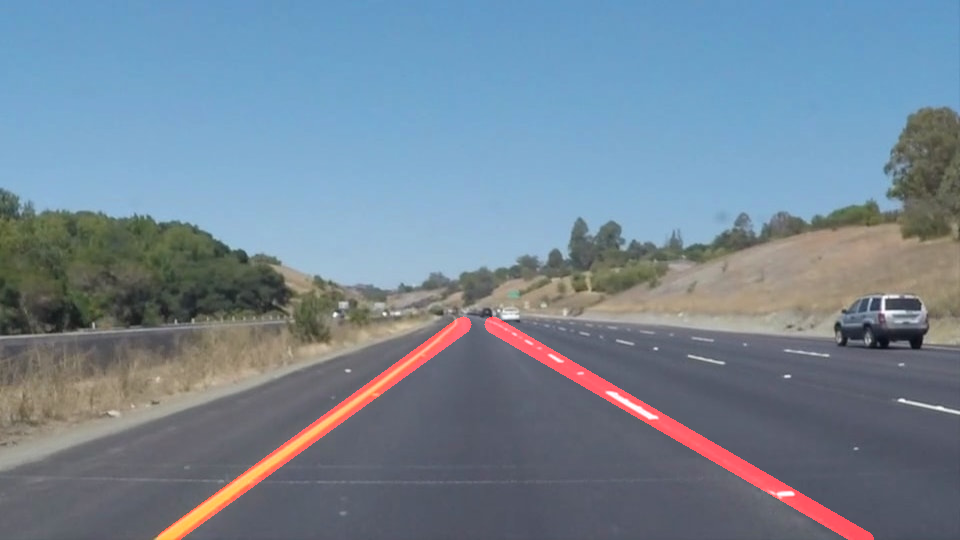

# **Finding Lane Lines on the Road** 

## Writeup

---

**Finding Lane Lines on the Road**

The goals / steps of this project are the following:
* Make a pipeline that finds lane lines on the road
* Reflect on your work in a written report

[//]: # (Image References)

---

### Reflection

### 1. Describe your pipeline. As part of the description, explain how you modified the draw_lines() function.

My pipeline consisted of several steps: 
* I converted the images to grayscale, then I apply Gaussian smoothing to the image before Canny edge detection. 
* Canny edge detection algorithm is called in the next step to obtain clear edges of the grayscale image. The idea of the Canny algorithm is to observe the sharp gradient change from the gradient image. 
* Depending on the application, not all the edge lines are useful information to us. In this lane detecting project, we hence create a  polygon region of interest (ROI) covering the possible positions where lane lines in front view could appear. The region outside of the ROI of the edge image matrix data is masked. 
* Hough Line transformation algorithm is called to detect lines in the ROI based on the given parameters like distance/angular resolution etc. 
* In order to draw a single line on the left and right lanes, the endpoints of each line detected through Hough line transformation algorithm are categorized into "left lane lines" and "right lane lines" types. Right now the sort criterion is simple, for example if endpoints of the line locates in the left 2/3 and its slope is around -0.6 within a given range then the line is included into the "left lane lines" category. A straight line mode y=k*x+b is used to fit the lines inside the left and right category respectively. Its slope k is calculated as the the average slope of each category. The average of (x, y) coordinates in each category could be viewed as one point on the straight line. Its intercepts with the bottom of the image and with the top of ROI could then be extrapolated with the straight line model. 

The identified five images with the pipeline explained above is shown here: 

 
   
   
  

 
   
   
   

### 2. Identify potential shortcomings with your current pipeline

One potential shortcoming would be the weak robustness of the edited pipeline. The light intensity change due to weahter or shade, the  position of lane lines in the image/video, other line shapes in the masked regions and etc. are all potential factors contributing to the false identification of the lane lines.  

Another shortcoming is that there are still plenty of space to improve current sort method and the way to construct the line model.

### 3. Suggest possible improvements to your pipeline

Possible improvements could be made in these aspects:
* Rather than a fixed ROI, it would be ideal for the program to decide ROI itself from the image, which improves the adaptability of the pipeline to other images/videos with slightly different camera positions
* To construct the lane line more accurately, interpolations on the edge lines in each category could first be carried to generate more discrete datapoints, and then least square method could be used to obtain the straight line model. In this way, the lane line would be more robust. 
* Another thought is that in videos because neighbouring frames are related, this feature could be potentially used to obtain a more consistent lane lines. 

* Current method to sort the lines

